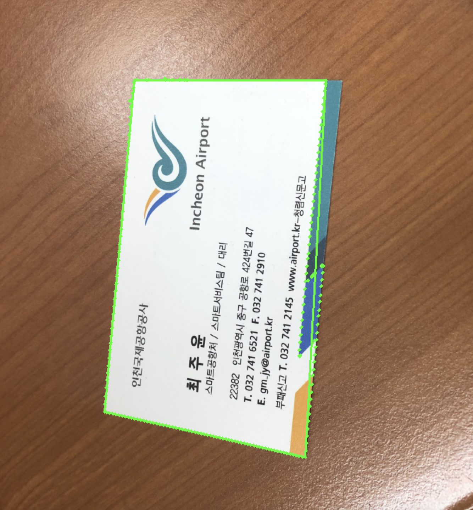
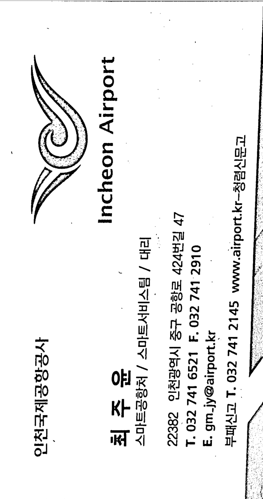

# business card 인식

### 환경

- Python 2.7.15 
- opencv : 2.4.11
- numpy

학교 선배의 incheon business card를 인식해보겠다.

input은 images/incheoner.jpeg 이다

output은 명함안에 있는 글씨를 인식하는 것이다.

## opencv 를 이용해서 명함 사각형 찾기

```python
imgfile = 'images/incheoner.jpeg'
img = cv2.imread(imgfile, cv2.IMREAD_COLOR)
...
imgray = cv2.cvtColor(img, cv2.COLOR_BGR2GRAY)
...
edge = cv2.Canny(imgray, 70, 200)
contours, hierarchy = cv2.findContours(edge, cv2.RETR_LIST, cv2.CHAIN_APPROX_SIMPLE)
```

- 상대경로로 이미지사진을 가져온다.

- cv2.imread() : COLOR로 이미지를 읽어온다.

- cv2.cvtColor : 색상을 COLOR 에서 GRAY로 변경한다. 

  - BGR->Grayscale로 변환하기 위해서는 *cv2.COLOR_BGR2GRAY* 파라미터를 사용한다.

- cv2.Canny() : 가장자리 검출을 적용한다. 

- cv2.findContours() : 컨투어를 찾는다.

  - 이미지에서 컨투어란 동일한 색 또는 동일한 픽셀값(강도,intensity)을 가지고 있는 영역의 경계선을 연결한 선을 말한다. 일기예보나 지도의 등고선과 같은 것이다. 이미지에서 컨투어는 물체의 윤곽선, 외형을 파악하는데 사용된다. 

  - image - 그레이스케일 이미지 혹은 이진화한 이미지를 넣어줘야한다.

  - cv2.RETR_LIST : 모든 컨투어 라인을 찾지만, 상하구조관계를 구성하지 않음

  - cv2.CHAIN_APPROX_SIMPLE : 컨투어라인을 그릴 수 있는 포인트만 반환

    

```python
for c in cnts:
    epsilon = 0.02 * cv2.arcLength(c, True)
    #approx is vertex index
    approx = cv2.approxPolyDP(c, epsilon, True)
    #because business card is square
    if len(approx) == 4:
        square = approx
        break
```

- cv2.arcLength() : 컨투어의 둘레구하기
  - True 일 때는 컨투어의 시작점과 끝점을 이어 도형을 구성하고 그 둘레 값을 계산한다
- cv2.approxPolyDP() : 
  - 컨투어 추정은 Douglas-Peucker 알고리즘을 이용해 컨투어 포인트의 수를 줄여 실제 컨투어 라인과 근사한 라인을 그릴 때 사용된다. OpenCV에서는 `cv2.approxPolyDP()` 라는 함수로 구현되어 있다.
  - 파라미터로는 컨투어 포인트 배열, 실제 컨투어 라인과 근사치의 최대거리, 폐곡선 여부가 있다. 
  - 길이의 약 2% 오차를 두어 도형을 근사해서 구함
- if len(approx) == 4 : 도형을 근사해서 추출한 외각의 꼭지점이 4개라면 그것을 명함의 사각형이라고 인식함 

```python
cv2.drawContours(img, [square], -1, (0,255,0), 2)
rect = order_points(square.reshape(4,2) / r)
(topLeft, topRight, bottomLeft, bottomRight) = rect
...
dst = np.float32([[0,0], [maxWidth-1, 0], [maxWidth-1, maxHeight-1], [0, maxHeight-1]])
M = cv2.getPerspectiveTransform(rect, dst)
result = cv2.warpPerspective(orig, M, (maxWidth, maxHeight))
result = cv2.cvtColor(result, cv2.COLOR_BGR2GRAY)
fin = cv2.adaptiveThreshold(result, 255, cv2.ADAPTIVE_THRESH_MEAN_C, cv2.THRESH_BINARY, 21, 10)
```

- cv2.drawContours() : 이미지의 컨투어를 시각화 한다.

- order_points() : 4개의 점을 가공한다.

  - ```python
    def order_points(pts):
        rect = np.zeros((4, 2), dtype="float32")
        s = pts.sum(axis=1)
        rect[0] = pts[np.argmin(s)]
        rect[2] = pts[np.argmax(s)]
    
        diff = np.diff(pts, axis=1)
        rect[1] = pts[np.argmin(diff)]
        rect[3] = pts[np.argmax(diff)]
    
        return rect
    ```

- cv2.getPerspectiveTransform() : 변환 행렬 구하기

  - 원근법이 적용된 효과를 제거함

- cv2.warpPerspective() : 변환행렬값을 적용하여 최종 결과 이미지 얻기

- cv2.cvtColor() : 색상을 COLOR 에서 GRAY로 변경한다. 

- cv2.adaptiveThreshol() : 이미지의 작은 영역별로 thresholding을 하기. 적응 임계처리라고 한다.

## 결과 






