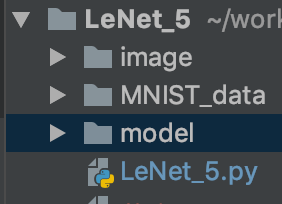

## LeNet 5 

소스 파일이 있는 directory에 *model* 이라는 directory를 만들어 줘야 함



1. 환경:

   - Python 3.6.8 :: Anaconda custom (64-bit)

   - import tensorflow as tf
     tf.__ version __
     '1.12.0'

   - ```python
     from tensorflow.examples.tutorials.mnist import input_data
     ```

2. 모델 구현:

   - ````python
     def LeNet(x):
         # Hyperparameters
         mu = 0
         sigma = 0.1
         layer_depth = {
             'layer_1': 6,
             'layer_2': 16,
             'layer_3': 120,
             'layer_f1': 84
         }
     ````

   - 