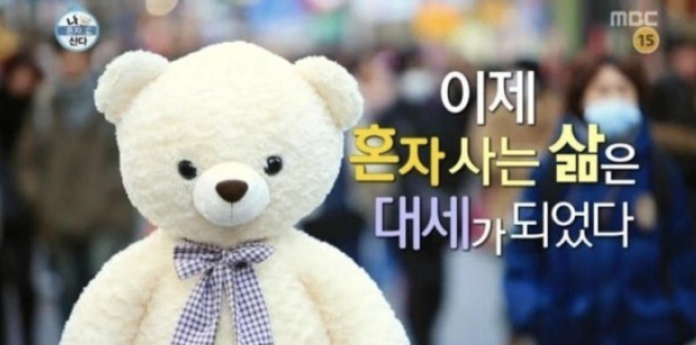
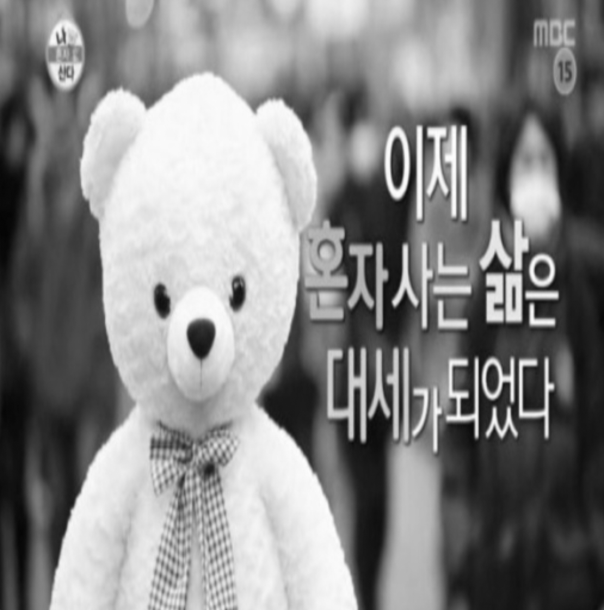
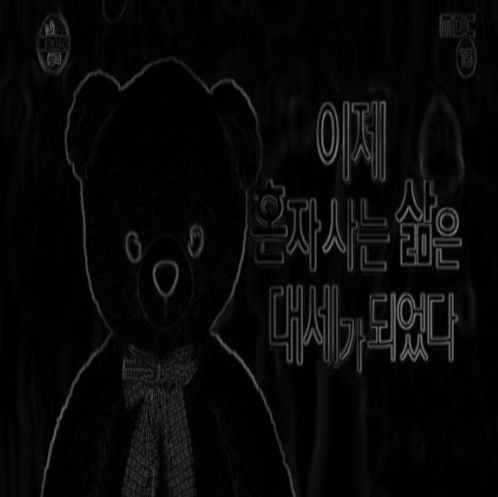
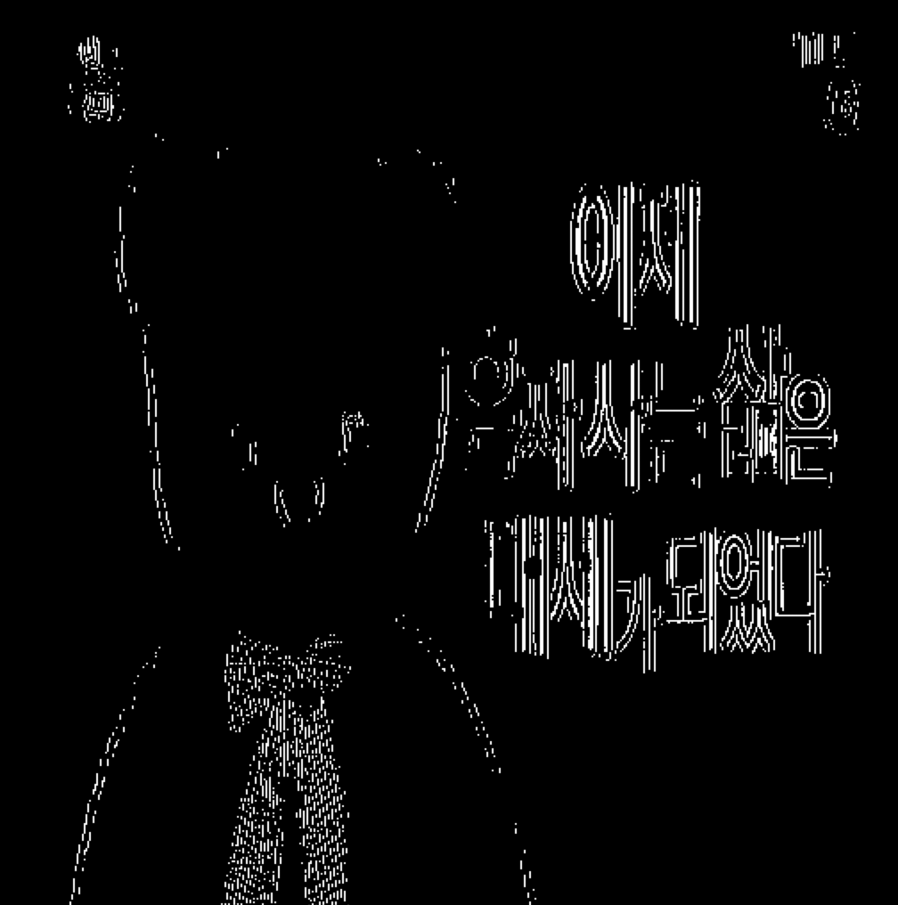
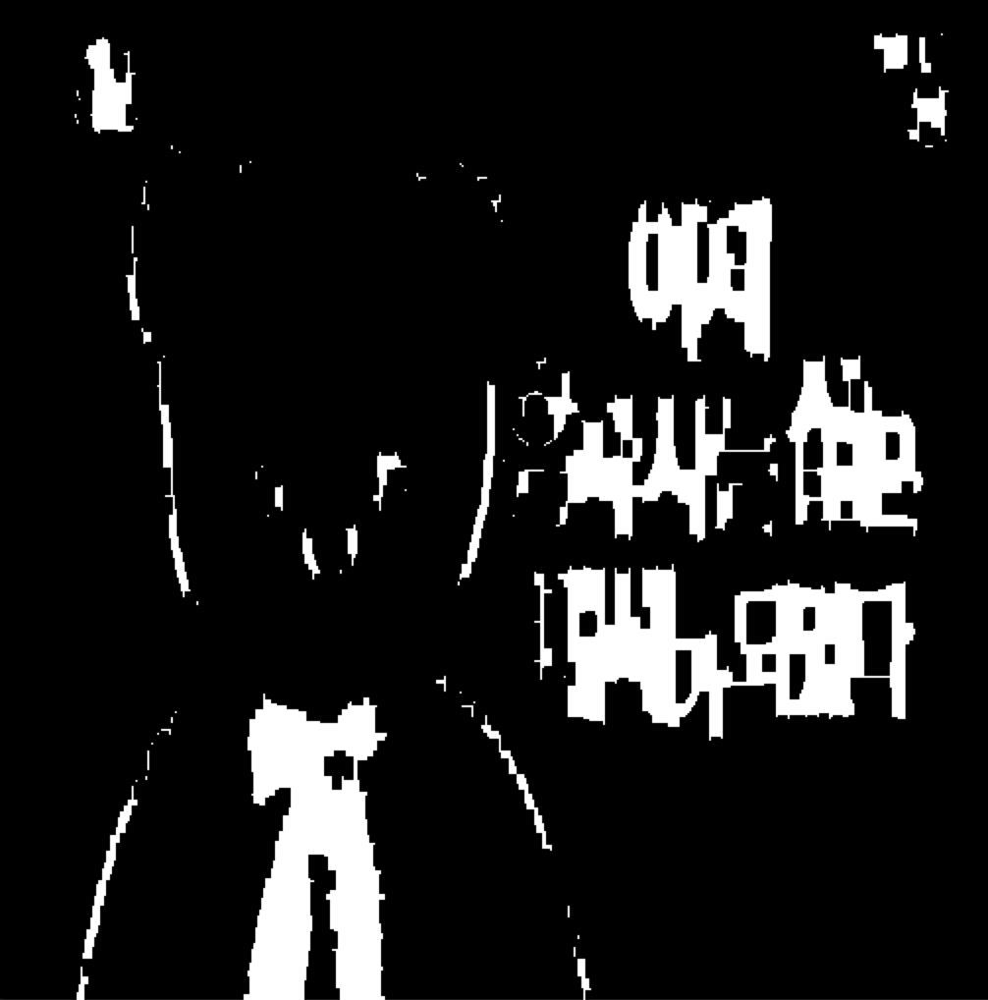
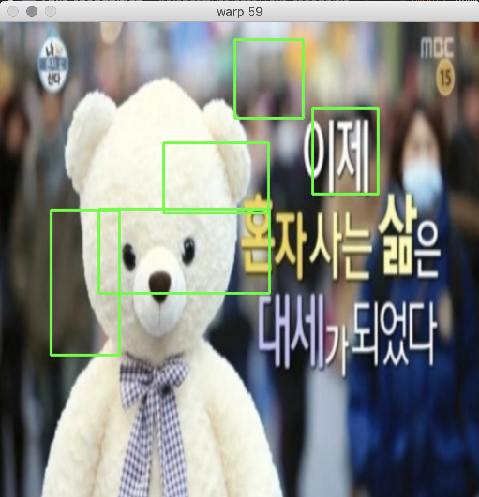
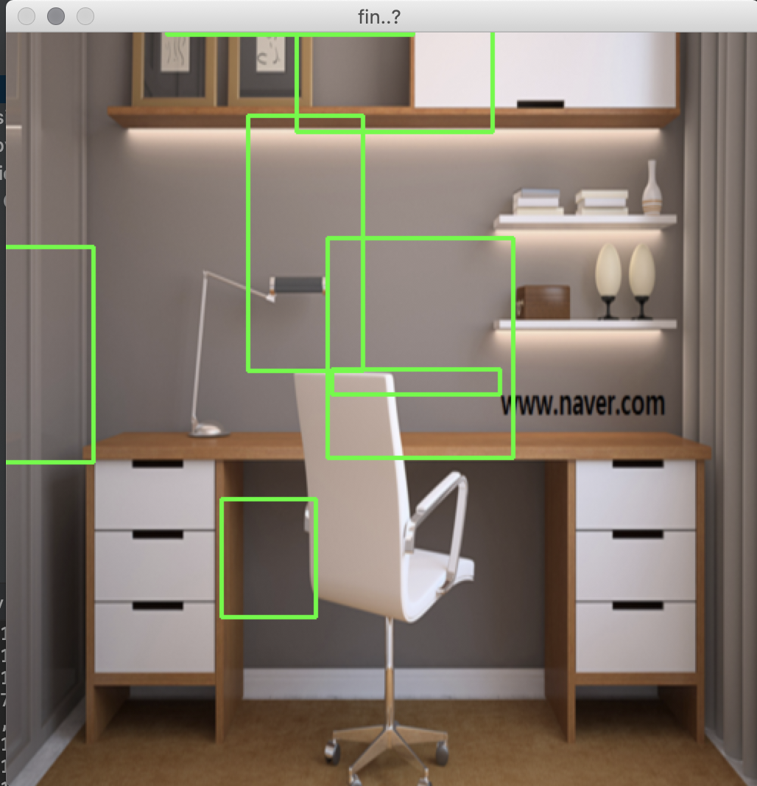
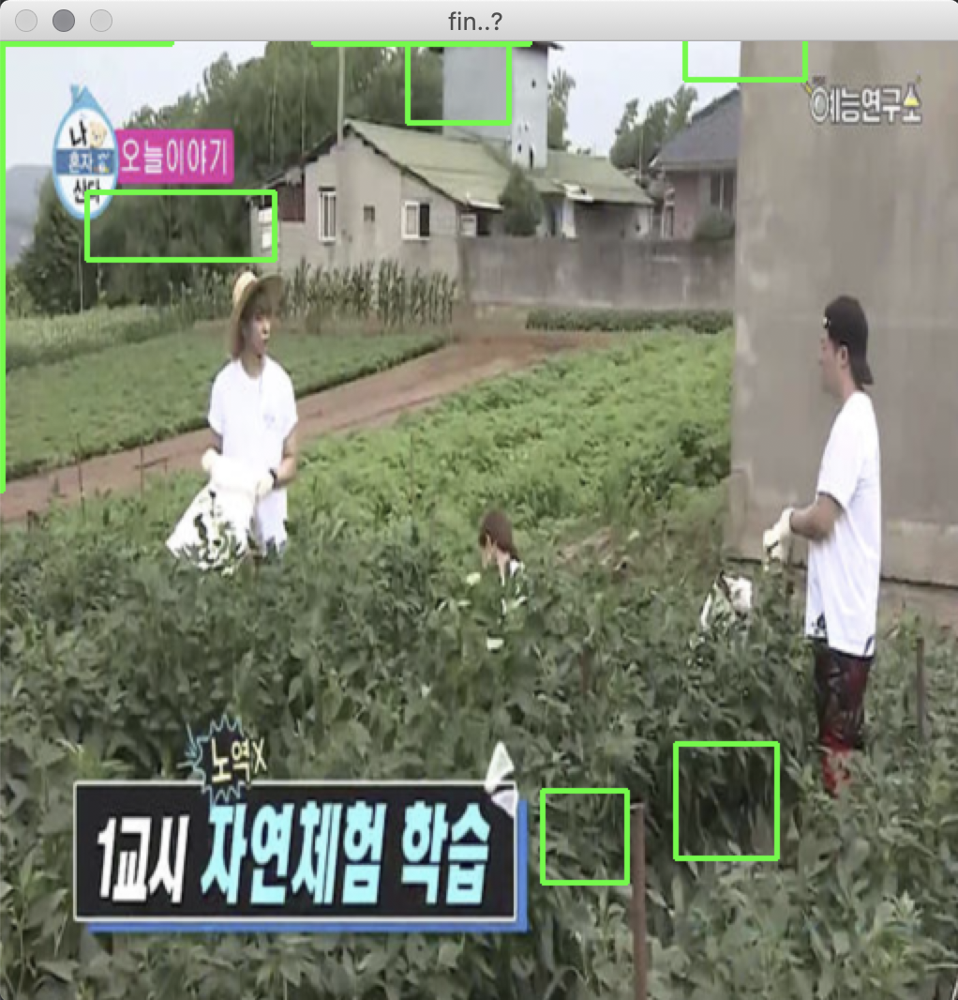
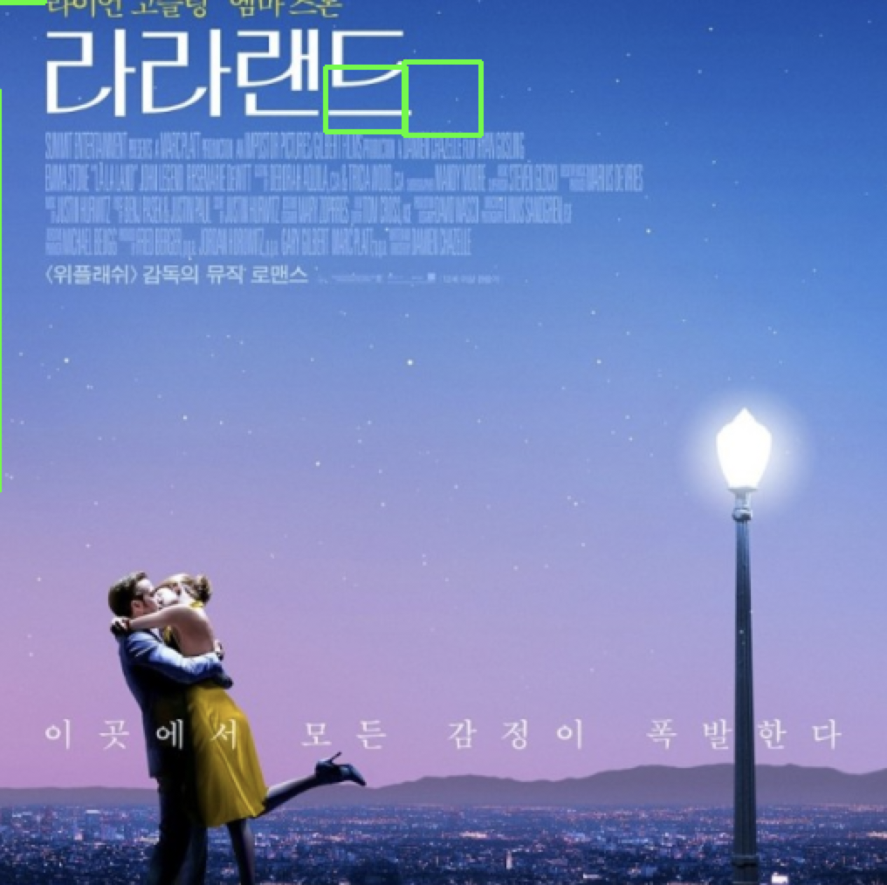

# Text_recogniton

[참고: 딥러닝과 OpenCV를 활용해 사진 속 글자 검출하기](https://d2.naver.com/helloworld/8344782)

opencv 사용하는거 친숙해지기

### 환경

- Python 2.7.15 

- opencv : 2.4.11

- numpy

  

## OCR(optical character recognition)

광학 문자 인식이다. 내가 스캔한 문서, 사진으로 찍은 문서 또는 이미지 파일의 텍스트를 컴퓨터나 태블릿 상에서 주욱 긁어서 복사를 해 줄 수 있게 하는 기술이다.

OCR기능을 이용하게 되면 기존에 인식하지 못했던 텍스트를 인식하게 되므로, 그 텍스트를 편집하거나 다른 형태로 변환하는 것이 가능하다.

하지만, OCR엔 과제들이 많이 남아있다. 그리고 최근엔 이러한 과제들을 딥러닝을 이용해 해결할려고 한다. 텍스트가 있다고 추정되는 영역만 바로 추출해서 CNN에 인식시키는 것도 좋은 방법이라 생각된다.

Ocr은 text localization과정과  text recongnition로 이뤄져있다.

가만히 생각해보면 문자 인식은 Object detection 문제와 굉장히 비슷한 느낌이다. 하지만 조금 다르다고 한다. 

- 뭐가 더 어려울까 : ocr 이 더 어렵다고 한다.
- 왜 어려울까 : Large variation 때문이다. 
  - Various aspect ratio
  - High density
  - Large distortions 옷 꾸깆꾸깆
  - Few pretrained models
  - Various languages.

### Text localization 관련 논문 : (...*최근엔 이러한 과제들을 딥러닝을 이용해*...)

- Regression-based : like object detection : textboxes : 2017년 논문
- Classification-based : like semantic segmentation : pixelLink :  2018년 논문 이게 안정적이고 추세하고 한다@


## 간단하게 생각해보자

명함 인식하기는 이미지 전처리 즉, 문자 유형 검출의 효율성과 정확성을 보장하기 위해 OpenCV를 활용한 이미지 전처리(pre-processing) 과정+ 문자 인식 인것이다.

명함같은경우는 사각형이라는 특징이 있고 이를 edge를 통해 잡아내서 사각형 중심으로 추출하면 된다. 하지만 다음과 같은 그림에서 문자를 잡을려면 어떻게 해야할까?



문자의 특징을 추출해야할까? 우선 비슷한 색끼리 묶어봐야할까? 이미지에서 글자를 찾는것은 주어진 이미지에서 색깔을 기반으로 그룹을 지은 덩어리를 추출하는 것이라고 한다. ex) 곰돌이 인형은 베이지 색 덩어리, '이제'라는 글씨는 하얀색 덩어리 

이런 덩어리 특징들을 잘 캐치해 크롭한뒤 network에 넣어 학습해주면 효과적이겠다.

## 코드

```python
import numpy as np
import cv2

imgray = cv2.cvtColor(img, cv2.COLOR_RGB2GRAY)
```

- RGB -> GRAY

  

```python
kernel_gradient = np.ones((2, 2), np.uint8)
mor_result = cv2.morphologyEx(imgray, cv2.MORPH_GRADIENT, kernel_gradient)
```

- morphology gradient 적용

  

```python
adapt_result= cv2.adaptiveThreshold(mor_result, 255, cv2.ADAPTIVE_THRESH_MEAN_C, cv2.THRESH_BINARY_INV, 3, 10);

```

- adaptiveThreshold 적용

  

```python
kernel_close = np.ones((9, 5), np.uint8)
mor2_result = cv2.morphologyEx(adapt_result, cv2.MORPH_CLOSE, kernel_close)
```

- morphology close 적용

  

```python
contours, hierarchy = cv2.findContours(mor2_result, cv2.RETR_EXTERNAL, cv2.CHAIN_APPROX_SIMPLE)
```

- contours 찾기

```python
for c in contours:
    rect = cv2.boundingRect(c);
    print rect
    x, y, w, h = rect
    if h > 10 and w > 40 and not(w >= 512 - 5 and h >= 512 - 5):
        cv2.rectangle(img, (x,y),(x-w,y-h), (0, 255, 0), 2)
```

- 찾은 contours 마다 직사각형으로 바운딩해 좌표 정보와 width,height 정보를 이용해서 직사각형 그리기

## 결과

내가 원한만큼 결과가 나오지 않았다. 

커널의 사이즈와 함수의 파라미터를 알맞게 조율하는 과정이 힘들었고 이에 따라 결과가 너무 다르게 나와 어떻게 조율해야 가장 좋게 나오는지 감을 잘 못잡았다.

예전에 object detction 할때 object 가 있을만한곳을 추천해주는 CNN 모델이 생각났다. 최근 논문들이 이를 이용해서 성능을 개선했다는데 한번 읽어봐야 겠다. 역시 segmentation이 안정적이고 요즘 추세라고 한다. 이부분을 중점으로 공부해봐야겠다.

- Regression-based : like object detection : textboxes : 2017년 논문
- Classification-based : like semantic segmentation : pixelLink :  2018년 논문 










