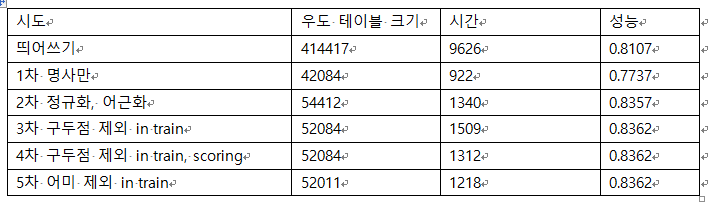
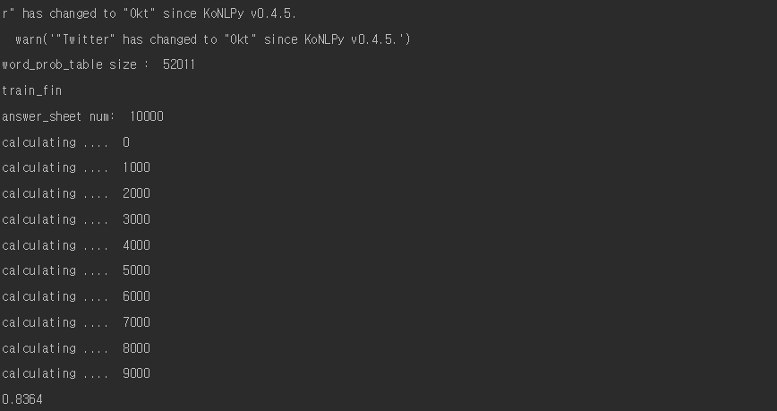
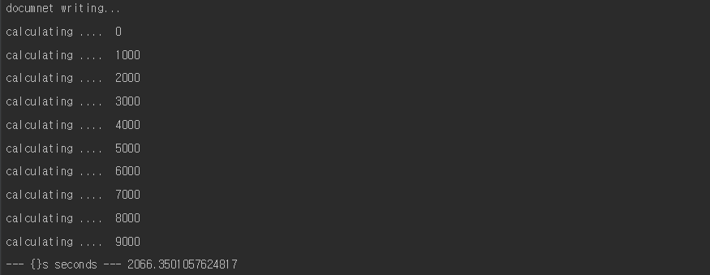
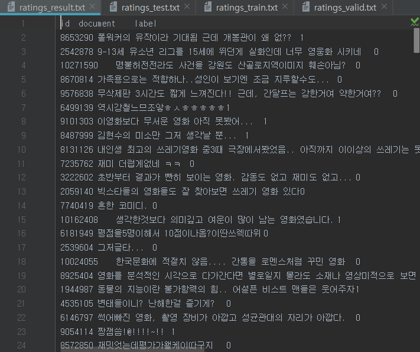

## review_classify_with_NaiveBayes ##


#### Naive Bayes Classification 기법을 이용하여 네이버 영화 리뷰 데이터셋 긍정/부정 분류하기

### 1. 데이터 셋

   - document(Raw sentence) / 긍정 , 부정 label(0= 부정, 1= 긍정)

   - ratings_train.txt : label 있음

   - ratings_valid.txt : label 있음

   - ratings_test.txt : label 없음

   - ratings_train.txt으로 나이브-베이즈 모델을 학습하여 ratings_test.txt의 lable을 예측하여 예측 결과를 ratings_result.txt에 저장한다.
   
   - ratings_*.txt는 ./sorce/ratings_data.zip에 있다.

### 2. 환경

   - 프로그래밍 언어 : python 3.5
   - OS: window
   - editor: Pycharm, Anaconda

### 3. 과정

   - 파일읽기
   - train하기 (train)
   - valid로 점수 내기 (scoring)
   - 개선해보기
   - test 해보기 (result)

   ```python
   model.train(train_name)
   model.scoring(valid_name)
   model.result(test_name)
   ```


### 4. 파일읽기

   - 한글 파일을 읽어오기 위해 

     ```python
     import codecs
     f = codecs.open("./" + where + ".txt", 'r', "utf-8")
     ```

   - 해당 raw data는 \t으로 구분되어 있기에 

     ```python
     result2 = line2.split("\t")
     list1.append([result2[1], result2[2]])
     ```

     - id와 review, tag중 필요한 부분인 review와 tag만 list1에 담아주었다.

   - 전체코드

     ```python
         def text_read(self,where):
             f = codecs.open("./" + where + ".txt", 'r', "utf-8")
             ...
             line2 = f.readline()
             list1 = []
             while line2:
                 ...
                 result2 = line2.split("\t")
                 list1.append([result2[1], result2[2]])
                 line2 = f.readline()
             return list1
     ```

### 5. train하기

   - 우선 reivew부분을 어떤 형태소 분석기를 이용해서 단어를 분류할 것인지를 선택해야한다. 

     - 띄어쓰기
     - KoNLPy

   - 띄어쓰기 예시

     - ```python
       def train(self,trainfile_path):
           out_list = self.text_read(train_name)
           ...
           word_count = self.count_words(out_list)
           ...
           self.word_prob_table = self.word_probability(word_count, negnum, posnum, self.k)
           ...
       ```

   - 업로드된 파일은 KoNLPy의 twitter을 사용함
       - text_read() 함수를 이용해  data를 읽어오고, count_words() 함수를 이용해 단어별 빈도수를 세줍니다. word_probability() 함수를 이용해 단어별 빈도수 비율을 확률로 계산해줍니다.
       - 최종적으로 단어별 [ W, P(W | pos), P(W | neg) ] 확률을 구한 word_prob_table을 완성합니다.
       ```python
       def tokenize(message):
           t = Twitter()
           all_words= t.pos(message,norm=True, stem=True)
           return set(all_words)
       ```

### 6. scoring 하기

   - 완성된 word_prob_table을 이용해서 정답이 있는 (tag)가 되어 있는 review의 tag값을 예츶해보고 예측한 결과와 정답을 비교해서 맞은 비율을 계산합니다.

     ```python
         def scoring(self,name2):
             ...
             corret = 0
             ...
             for ans in answer_list:
                 ...
                 prediction = self.classify(ans[0])
                 if int(ans[1]) == prediction:
                     corret += 1
                 ...
             print(corret / answernum)
     ```

     - classify함수를 사용해서 단어별 P(pos | W) 확률과 P(neg | W)를 계산합니다. 더 자세한 설명은 문서를 참고하세요.

### 7. result 완성하기

   - scoring 확률을 어느정도 개선한후, 
      

   - tag가 없는 데이터에 예측 tag를 달아줬다.

     ```python
         def result(self,where):
             ...
             f2 = codecs.open("./" + "ratings_result" + ".txt", 'w+', "utf-8")
          	...
             print('documnet writing...')
             counting2 =0
             for ans in list2:
                 ...
                 prediction = self.classify(ans[1])
                 ans.append(str(prediction))
                 ...
                 string2 = ans[0]+'\t'+ans[1]+'\t'+ans[2]+'\n'
                 f2.write(string2)
                 ...
             f2.close()
     ```

     - tag가 없는 ratings_result.txt파일의 id, review 부분을 읽어와 list2에 담고 review을 classify() 함수를 이용해서 tag값을 예측한다.
     - 예측값을 string2 끝에 더해주고 파일을 쓴다.
     - 파일을 수정한 뒤 close()를 반드시 해줘야 수정된 상태가 저장된다.

### 8. 결과

정확도: 0.8364



새로 만들어진 ratings_result.txt 결과물


